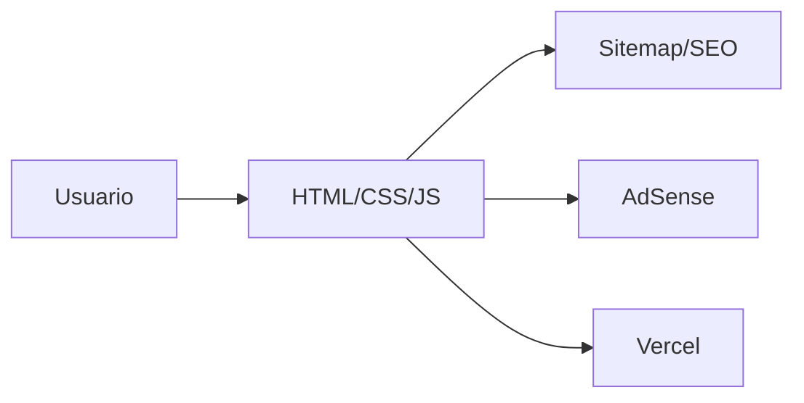

# Documentacion General del Sistema — ElCache10

> Documento para onboarding IT, mantenimiento del sitio, SEO, AdSense y despliegue.

## 1. Vision General del Proyecto

ElCache10 es un sitio de contenido/entretenimiento bajo `elcache10.com`, construido como sitio estatico y desplegado en Vercel. El objetivo es publicar contenido indexable, optimizado para SEO y monetizable con Google AdSense.

| Area | Detalle |
|---|---|
| Objetivo | Sitio de contenido rapido y monetizable. |
| Publico | Usuarios de entretenimiento/contenido general. |
| Modelo | AdSense + contenido. |
| Estado | Live; revisar AdSense y `ads.txt`. |

## 2. Arquitectura

## 3. Tecnologias

| Tecnologia | Uso |
|---|---|
| HTML/CSS/JS | Sitio estatico. |
| Vercel | Hosting y deploy. |
| Node script | Generacion de sitemap. |
| Google AdSense | Monetizacion. |

## 4. Funcionalidades

- Paginas de contenido.
- Sitemap generado por `generate-sitemap.js`.
- `ads.txt` en raiz.
- Politicas legales enlazadas.
- SEO metadata.
- Deploy Vercel.

## 5. Flujo del Usuario

1. Usuario entra al dominio.
2. Consume contenido.
3. Navega por secciones.
4. Google muestra anuncios si el sitio esta aprobado.
5. Footer permite acceder a legales/contacto.

## 6. Estructura de Datos

Proyecto estatico. Si crece:

| Entidad | Campos |
|---|---|
| `pages` | `slug`, `title`, `description`, `category`. |
| `posts` | `slug`, `title`, `body`, `published_at`, `tags`. |

## 7. Seguridad

- No secrets en repo.
- No romper `ads.txt`.
- Evitar dependencias innecesarias.
- Revisar scripts externos.

## 8. UI/UX

Mobile-first, carga rapida, lectura clara, anuncios no intrusivos, navegacion simple y footer legal visible.

## 9. SaaS y Escalabilidad

No es SaaS. Escala como medio digital con mas contenido, categorias, automatizacion SEO y analitica.

## 10. Deployment

- Vercel como hosting principal.
- Ejecutar `node generate-sitemap.js` si cambian paginas.
- Verificar `https://elcache10.com/ads.txt`.
- No usar rewrites que oculten `/ads.txt`.

## 11. Proximos Pasos

- Revalidar AdSense.
- Expandir contenido original.
- Revisar Search Console.
- Mejorar Core Web Vitals.
- Mantener sitemap y robots.

## 12. Notas para IT

- Prioridad tecnica: SEO, velocidad, cumplimiento AdSense y estabilidad de deploy.
